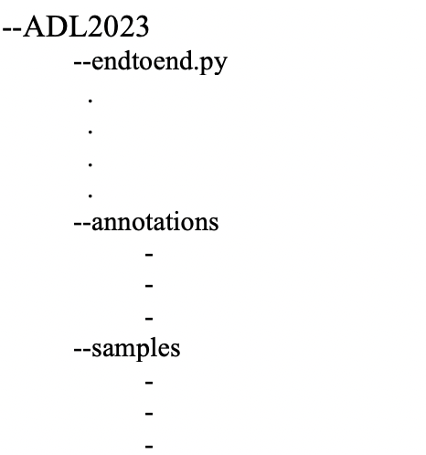

# ADL2023

<h1>Digging Deeper into Automatic Music Tagging</h1>

<h3>This is the coursework submission for COMSM0045 - Applied Deep Learning.</h3>

To run our model, the sample and annotations folders have to be in the same folder as endtoend.py. The format should be as follows:

--You can run our code with the basic CNN architecture for length and stride of 256 for strided convolution by uncommenting the following line in the endtoend.sh:

#python endtoend.py --model="Basic"

--You can run our code with the basic CNN model for different lengths and strides for the strided convolution by uncommenting the following line in the endtoend.sh:

#python endtoend.py --model="Basic" --length-conv=1024 --stride-conv=512

Here, change the values for --length-conv and --stride-conv according to the lengths and strides, respectively.

--You can run our code with the basic extension2 to the CNN model with Group Normalisation and Dropout by uncommenting the following line in the endtoend.sh:

#python endtoend.py --epoch=40 --model="Extension1"

--You can run our code with the deep CNN extension2 by uncommenting the following line in the endtoend.sh:

#python endtoend.py --model="Deep"

Here, this takes 5 hours to run so please have --time around 6 or above.
